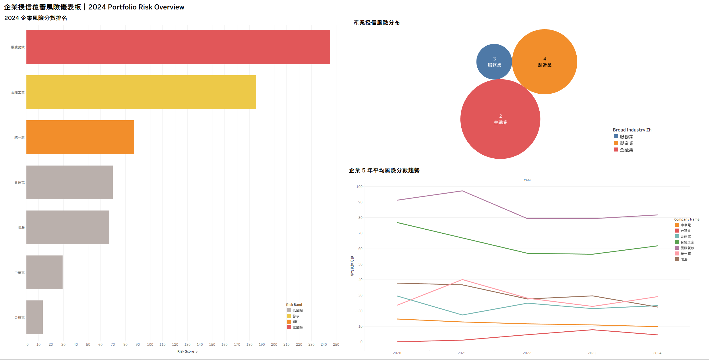

# Annual Credit Review Intelligence Tool  
### AI-Assisted Credit Risk Analytics Dashboard

This project is an end-to-end analytics workflow that simulates how a financial institution can support its annual credit review process using **Python**, **financial risk indicators**, **Tableau dashboards**, and **auto-generated credit review reports**.

本專案模擬金融機構在年度授信覆審中，如何透過資料分析、風險評分與視覺化儀表板，協助授信分析師更快辨識高風險公司、產業集中風險與潛在財務惡化訊號。

> **Disclaimer**  
> This project uses 100% synthetic data and is built for portfolio demonstration purposes.  
> It is **not** an automated loan approval system. It is an **AI-assisted decision support tool** designed to help analysts identify risks faster while keeping final credit decisions human-reviewed.

---

## Dashboard Preview

> Add your Tableau dashboard screenshot here after saving it as `docs/Dashboard_preview.png`.



---

## Project Summary

Annual credit review is often manual, repetitive, and difficult to standardize. Analysts need to review financial statements, compare companies across industries, identify deteriorating borrowers, and prepare internal review materials.

This project demonstrates a practical workflow that connects:

```text
Synthetic financial data
        ↓
Python data pipeline
        ↓
Financial ratio calculation
        ↓
Risk flags + anomaly detection
        ↓
Suggested credit actions
        ↓
Tableau dashboard
        ↓
Auto-generated credit review reports
```

The goal is to show how a data analyst can turn structured financial data into a portfolio-level risk monitoring tool.

---

## Business Problem

Financial institutions often face several challenges during annual credit review:

- Analysts spend significant time cleaning and reviewing financial statements.
- Risk assessment can be inconsistent across companies or analysts.
- Early warning signals may be missed if risk deterioration is gradual.
- Portfolio and industry concentration risks are difficult to monitor manually.
- Managers need concise summaries for review meetings and decision-making.

This project simulates a workflow that helps analysts move from raw financial data to structured risk insights more efficiently.

---

## Solution

The system processes multi-year company financial data and generates risk intelligence outputs for review.

| Component | Description |
|---|---|
| Data Pipeline | Cleans and processes synthetic financial data |
| Financial Ratios | Calculates debt ratio, current ratio, ROA, ROE, interest coverage, and Altman Z' Score |
| Risk Flags | Identifies high leverage, low liquidity, low interest coverage, negative profit, revenue decline, and distress signals |
| Anomaly Detection | Detects unusual financial changes across time |
| Risk Scoring | Combines rule-based signals and anomaly score into a composite risk score |
| Suggested Actions | Produces recommended credit review actions based on risk level |
| Tableau Dashboard | Visualizes company ranking, industry risk distribution, and five-year risk trend |
| Auto-generated Reports | Generates Markdown credit review reports for individual company-year records |

---

## Key Features

- End-to-end Python pipeline
- Financial ratio calculation for credit review
- Rule-based risk flag detection
- Time-series anomaly detection
- Composite risk score generation
- Suggested credit action logic
- Tableau-ready CSV output
- Interactive Tableau dashboard
- Auto-generated company-level Markdown reports
- Optional PostgreSQL / Docker support
- Human-in-the-loop design for responsible AI usage

---

## Tableau Dashboard

The Tableau dashboard is designed around three core review questions.

### 1. Company Risk Ranking

Helps analysts identify which companies require priority review.

Questions answered:

- Which companies have the highest risk scores?
- Which borrowers are classified as High or Critical risk?
- Which companies should be escalated for further review?

### 2. Industry Risk Distribution

Helps managers understand whether risks are concentrated in specific industries.

Questions answered:

- Which industries contain more high-risk companies?
- Is the portfolio exposed to industry concentration risk?
- Which sectors require closer monitoring?

### 3. Five-Year Risk Trend

Tracks whether company risk is improving or deteriorating over time.

Questions answered:

- Which companies show a worsening trend?
- Which companies improved after prior risk signals?
- Are there sudden changes in 2024 that require review?

---

## Tableau Interactivity

Recommended dashboard interactions include:

| Interaction | Purpose |
|---|---|
| Year Filter | Switch between review years |
| Risk Band Filter | Focus on High / Critical risk companies |
| Industry Filter | Drill down into a specific sector |
| Dashboard Filter Action | Click an industry bubble to update company ranking and trend charts |
| Tooltip Details | Show suggested action, review reason, and report path |
| URL Action | Click a company bar to open the GitHub Markdown credit review report |

### Report Link Design

Tableau does not directly run Python when users click the dashboard.  
Instead, reports are generated before the demo using Python, and Tableau opens the pre-generated GitHub report link.

```text
Python generates reports/*.md
        ↓
dashboard_credit_review.csv stores report_url
        ↓
Tableau URL Action opens report_url
```

---

## Auto-generated Credit Review Reports

The script below generates company-level Markdown reports:

```bash
python scripts/generate_company_reports.py --github-base-url "https://github.com/JoeyTaipei/Credit_review_analytics/blob/main/reports"
```

It will:

1. Read `outputs/dashboard_credit_review.csv`
2. Generate Markdown reports under `reports/`
3. Add `report_path` and `report_url` columns to `dashboard_credit_review.csv`
4. Allow Tableau to open company-level reports through URL Action

Example output:

```text
reports/
├── ABC_2024_credit_review.md
├── ABC_2023_credit_review.md
├── XYZ_2024_credit_review.md
└── ...
```

---

## Risk Scoring Methodology

### Step 1: Financial Ratio Calculation

| Ratio | Formula | Interpretation |
|---|---|---|
| Debt Ratio | Total Liabilities / Total Assets | Measures leverage |
| Current Ratio | Current Assets / Current Liabilities | Measures short-term liquidity |
| Interest Coverage | EBIT / Interest Expense | Measures ability to pay interest |
| ROA | Net Income / Total Assets | Measures asset profitability |
| ROE | Net Income / Equity | Measures shareholder return |
| Altman Z' Score | Modified private-firm distress score | Lower score indicates higher financial distress |

### Step 2: Rule-Based Risk Flags

The model identifies risk flags such as:

- High debt ratio
- Low current ratio
- Low interest coverage
- Negative net income
- Revenue decline
- Altman Z' distress signal

### Step 3: Composite Risk Score

```text
Composite Risk Score = Rule-Based Risk Score × 60% + Anomaly Score × 40%
```

The 60/40 weighting is a heuristic setting for demonstration purposes.

In a production environment, the weights should be calibrated using historical default labels and validated with model performance metrics such as AUC, KS, or Gini.

---

## Human-in-the-Loop Design

This project is designed as an **AI-assisted decision support system**, not an automated credit approval tool.

AI can help analysts:

- Organize financial indicators
- Identify potential risk signals
- Generate draft review summaries
- Suggest credit review actions

AI should not independently decide:

- Whether to approve or reject credit
- Whether to reduce credit limits
- Whether to require collateral
- Whether to escalate a borrower

Final credit decisions should remain with credit analysts, managers, or credit committees.

---

## Tech Stack

| Area | Tools |
|---|---|
| Programming | Python |
| Data Processing | pandas, NumPy |
| Modeling Logic | Rule-based scoring, anomaly detection |
| Visualization | Tableau |
| Reporting | Markdown, CSV |
| Database | PostgreSQL, SQLAlchemy |
| Environment | Docker |
| Version Control | Git, GitHub |

---

## Project Structure

```text
credit_review_tool/
├── scripts/
│   ├── generate_sample_data.py
│   ├── run_full_pipeline.py
│   ├── generate_executive_summary.py
│   ├── generate_case_study.py
│   └── generate_company_reports.py
│
├── src/
│   ├── financial_ratios.py
│   ├── feature_engineering.py
│   ├── anomaly_detection.py
│   ├── risk_flags.py
│   ├── credit_actions.py
│   └── agent_trace.py
│
├── outputs/
│   └── dashboard_credit_review.csv
│
├── reports/
│   └── *_credit_review.md
│
├── docs/
│   ├── interview_script_zh.md
│   ├── 10_day_finish_plan_zh.md
│   └── dashboard_preview.png
│
├── docker-compose.yml
├── requirements.txt
└── README.md
```

---

## How to Run

### 1. Clone the repository

```bash
git clone https://github.com/JoeyTaipei/Credit_review_analytics.git
cd Credit_review_analytics
```

### 2. Install dependencies

```bash
pip install -r requirements.txt
```

### 3. Run the pipeline without database

```bash
python scripts/run_full_pipeline.py --skip-db
```

### 4. Generate company-level reports

```bash
python scripts/generate_company_reports.py --github-base-url "https://github.com/JoeyTaipei/Credit_review_analytics/blob/main/reports"
```

### 5. Open Tableau

Use the following CSV as the Tableau data source:

```text
outputs/dashboard_credit_review.csv
```

---

## Main Outputs

| Output | Description |
|---|---|
| `outputs/dashboard_credit_review.csv` | Main Tableau data source |
| `reports/*.md` | Auto-generated company-level credit review reports |
| `outputs/executive_summary.csv` | Portfolio-level summary |
| `outputs/ratios_wide.csv` | Financial ratios in wide format |
| `outputs/anomalies.csv` | Anomaly detection results |
| `outputs/risk_flags.csv` | Risk flag results |

---

## Limitations

| Limitation | Impact | Future Improvement |
|---|---|---|
| Synthetic data only | Cannot validate real default prediction performance | Integrate real or public financial data |
| No default labels | Cannot train a supervised default model | Add historical default labels |
| Heuristic scoring weights | Risk score is not statistically calibrated | Calibrate with logistic regression or XGBoost |
| No macroeconomic variables | Does not reflect interest rate or GDP cycles | Add macroeconomic and industry indicators |
| Limited qualitative data | Does not analyze annual reports or news | Add LLM / RAG for document analysis in future phase |
| CSV-based dashboard demo | Not a production data architecture | Move to data warehouse or PostgreSQL live connection |

---

## Future Improvements

Planned improvements include:

1. **Real Data Integration**  
   Replace synthetic data with public financial statements or authorized institutional data.

2. **Model Calibration**  
   Use historical default labels to validate and calibrate risk scores.

3. **Macroeconomic Features**  
   Add interest rates, GDP growth, and industry cycle variables.

4. **LLM-Generated Credit Memo**  
   Use LLMs to generate draft credit review narratives from structured financial data.

5. **RAG for Unstructured Documents**  
   Add RAG only when annual reports, news articles, or internal credit memos are included.

6. **MLOps and Monitoring**  
   Add model monitoring, data drift detection, and scheduled recalibration.

---

## Interview Talking Point

This project demonstrates my ability to connect business problems with data analytics implementation:

```text
Business problem → Python data pipeline → financial risk logic → Tableau dashboard → auto-generated reports → human-reviewed decision support
```

It is designed to show practical data analyst skills in:

- Python data processing
- Financial risk analysis
- Dashboard design
- Business communication
- Responsible AI thinking
- End-to-end project execution

---

## Author

Built by Joey as a portfolio project for data analyst and analytics consulting internship applications.

